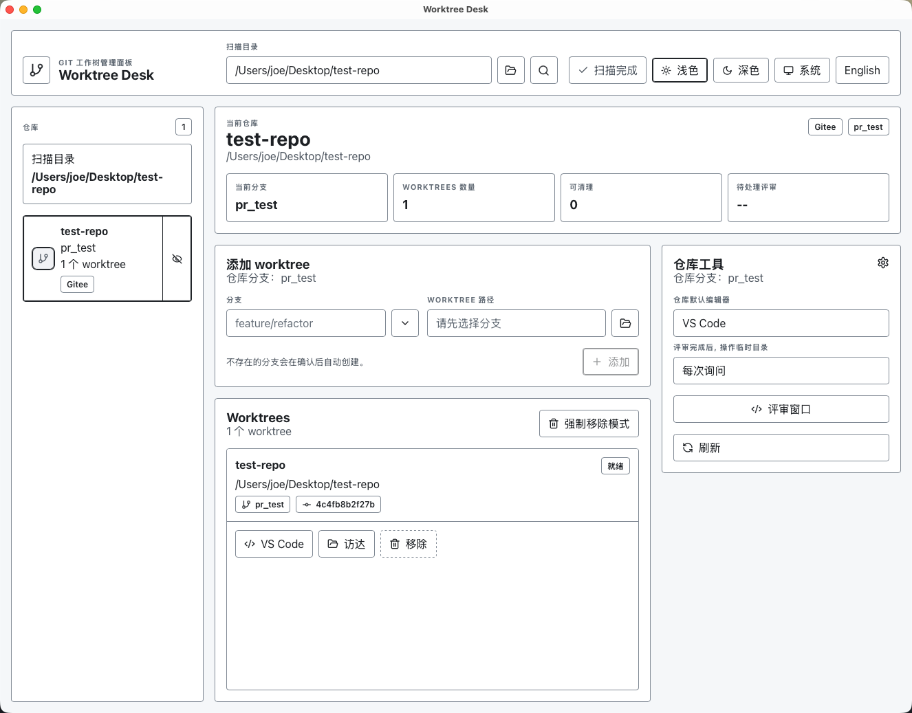
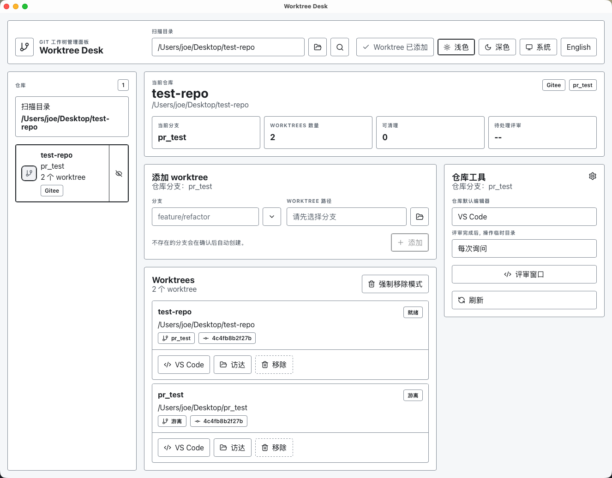
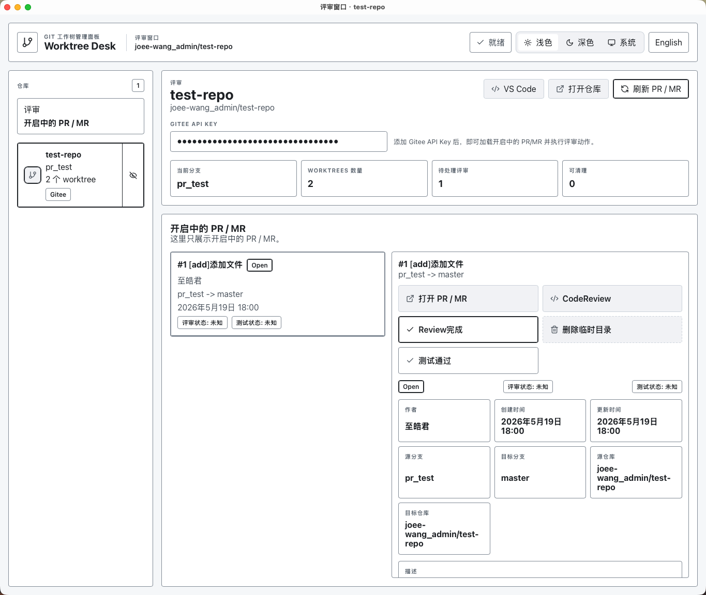

<p align="center">
	
</p>

# WorkTreeDesk

WorkTreeDesk 是一个基于 Tauri、React 和 Vite 构建的桌面应用，聚焦 Git Worktree 管理与 Code Review 场景。

## 功能概览

- 统一管理本地 Git Worktree
- 为代码审查场景提供更轻量的桌面操作体验
- 基于 Tauri 构建，兼顾性能与原生分发能力

## 应用截图




## 开发

### 环境要求

- Node.js
- Rust
- Tauri 2.x 构建环境

### 常用命令

```bash
npm install
npm run tauri:dev
```

构建发布版本：

```bash
npm run tauri:build
```

## GitHub Release

仓库已添加基于 Git tag 的自动发布工作流，配置见 `.github/workflows/release.yml`。

触发方式：

```bash
git tag v0.1.0
git push origin v0.1.0
```

工作流会在 GitHub Actions 中自动执行 macOS 打包，并把产物上传到对应的 GitHub Release。
当前发布矩阵会生成以下产物：

- macOS app bundle
- Windows NSIS 安装包
- Linux AppImage

---


也可以直接使用仓库内置的发布脚本自动完成版本号递增、提交、打 tag 和推送：

```bash
npm run release
```

默认执行补丁版本递增，也就是最小版本号 `patch + 1`。

如果需要升级中版本或大版本：

```bash
npm run release:minor
npm run release:major
```

脚本会同步更新以下版本号：

- `package.json`
- `package-lock.json`
- `src-tauri/Cargo.toml`
- `src-tauri/Cargo.lock`
- `src-tauri/tauri.conf.json`

随后自动执行：

- `git commit -m "chore(release): vX.Y.Z"`
- `git tag -a vX.Y.Z -m "Release vX.Y.Z"`
- 推送当前分支
- 推送对应 tag

脚本在执行前会检查：

- 当前目录必须是 Git 仓库
- 不能存在预先 staged 的更改
- 版本相关文件不能有未提交改动

> 如果发布时出现 `Resource not accessible by integration`，请到仓库的 Actions 设置中确认工作流令牌具备读写仓库内容的权限。

## Feature TODO

- 更多 Git 平台适配
- Code Review 流程整合
- 多仓库与多 Worktree 视图优化
