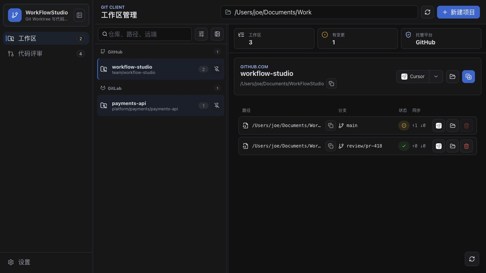
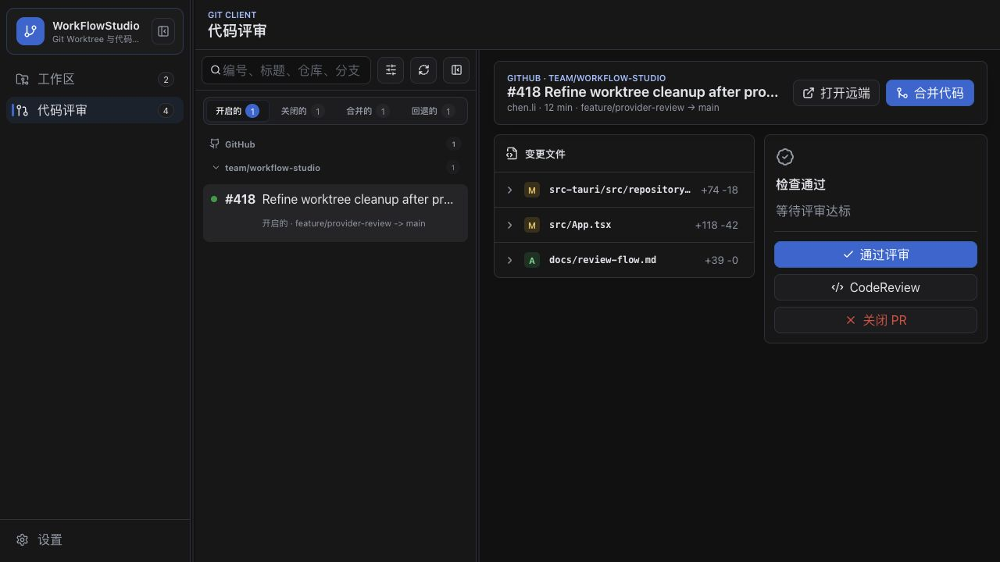
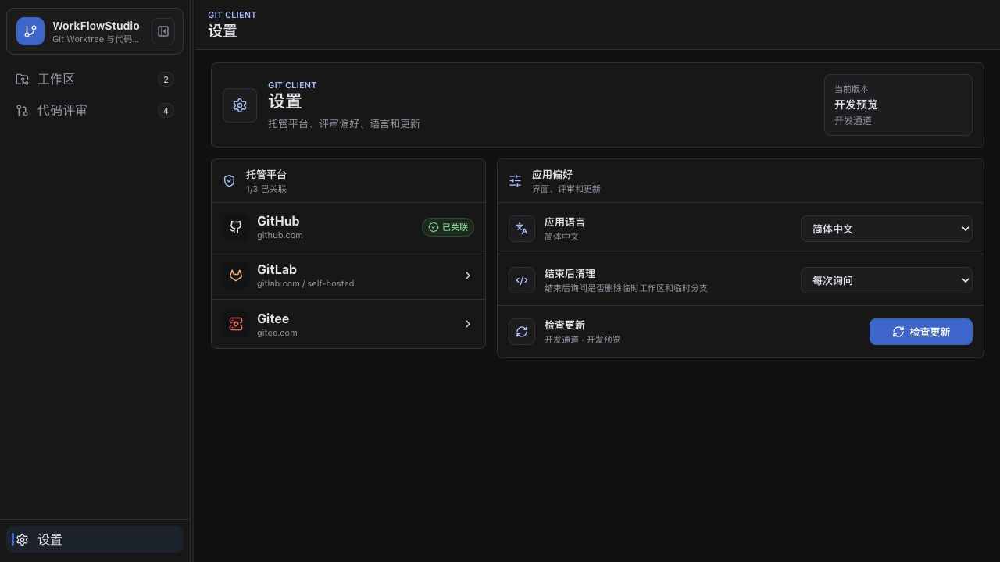

<p align="center">
  
</p>

# WorkFlowStudio

WorkFlowStudio 是一个基于 Tauri、React 和 Vite 构建的桌面应用，面向日常 Git Worktree 管理与代码评审流程。它把本地工作区、托管平台 PR/MR 队列、评审临时分支和应用更新整合到一个轻量的桌面工作台里。

> 目前安装包未做开发者签名，macOS 可能会拦截安装或启动。请只在确认来源可信的前提下，在系统设置中允许打开，或参考 Apple 官方说明：https://support.apple.com/zh-cn/HT202491
>
> 如果 macOS 仍提示应用已隔离，可执行：`sudo xattr -r -d com.apple.quarantine /Applications/WorkFlowStudio.app`。这个命令会移除隔离标记，请仅在信任该应用来源时使用。

## 功能概览

- 扫描并统一管理本地 Git 仓库和 Worktree
- 创建、打开、刷新、删除和清理 Worktree
- 识别 GitHub、GitLab、Gitee 远端仓库
- 在桌面端查看 PR/MR 队列、变更文件和评审状态
- 为 Code Review 创建临时本地 Worktree，并在评审完成后按偏好清理
- 支持稳定版与 Preview 版两个发布渠道
- 支持应用内检查、下载、安装并重启更新
- 支持中文、英文、日文界面

## 应用截图







## 开发

### 环境要求

- Node.js
- Rust
- Tauri 2.x 构建环境

### 常用命令

```bash
npm install
npm run tauri:dev
```

启动 Preview 渠道桌面应用：

```bash
npm run tauri:dev:preview
```

构建稳定渠道：

```bash
npm run tauri:build
```

构建 Preview 渠道：

```bash
npm run tauri:build:preview
```

本地默认打包不会生成 updater artifacts，也不会走发布用的 updater 签名流程。只有 GitHub Actions 发布任务会叠加 `src-tauri/tauri.release.conf.json`，生成可用于应用内更新的 `latest.json` 和签名产物。

渠道信息：

- stable: `WorkFlowStudio` / `com.codex.workflowstudio`
- preview: `WorkFlowStudio Preview` / `com.codex.workflowstudio.preview`

## GitHub Release

仓库已配置基于 Git tag 的自动发布工作流，配置见 `.github/workflows/release.yml`。

发布流程会完成：

- 构建 macOS app bundle、Windows NSIS、Linux AppImage
- 上传安装产物到 GitHub Release
- 上传 Tauri updater 需要的 `latest.json`
- 生成并上传 updater 签名文件
- 同步 `latest.json` 到 `updater` 分支的稳定版或 Preview 渠道目录

应用检查更新时会先读取当前 GitHub Release 中的 `latest.json`，并在应用内直接下载、安装和重启；`updater` 分支清单仍作为渠道化更新源保留。

渠道对应关系：

- stable 渠道读取 `updater/stable/latest.json`
- preview 渠道读取 `updater/preview/latest.json`
- 带预发布后缀的 tag 会被视为 Preview 渠道，例如 `v0.1.12-preview.1`

触发发布：

```bash
git tag v0.1.0
git push origin v0.1.0
```

当前发布矩阵产物：

- `mac-arm64`: macOS Apple Silicon
- `mac-x64`: macOS Intel
- `win-x64`: Windows x64
- `linux-x64`: Linux x64

资产命名格式为 `WorkFlowStudio_vX.Y.Z_<platform-code>` 加原始产物扩展名；`latest.json` 保持固定名称，供自动更新使用。

要启用自动更新，需要在仓库 Secrets 中配置：

- `TAURI_SIGNING_PRIVATE_KEY`: Tauri updater 私钥内容
- `TAURI_SIGNING_PRIVATE_KEY_PASSWORD`: 生成私钥时设置的口令；如果没有设置口令，可留空或按工作流实际配置调整

公钥已经写入应用配置，可以随代码分发；私钥不能提交到仓库。

## 发布脚本

仓库内置发布脚本可以自动完成版本号递增、提交、打 tag 和推送：

```bash
npm run release
```

默认执行 patch 发布。若当前版本是 Preview，例如 `0.1.12-preview.1`，稳定渠道 patch 发布会提升为对应正式版 `0.1.12`。

其他稳定渠道发布：

```bash
npm run release:minor
npm run release:major
```

Preview 渠道发布：

```bash
npm run release:preview
npm run release:preview:minor
npm run release:preview:major
```

Preview 默认生成类似 `0.1.12-preview.1` 的版本号；如果已经处于同一个 Preview 周期，再次发布会递增为 `0.1.12-preview.2`。

脚本会同步更新：

- `package.json`
- `package-lock.json`
- `src-tauri/Cargo.toml`
- `src-tauri/Cargo.lock`
- `src-tauri/tauri.conf.json`

随后自动执行：

- `git commit -m "chore(release): vX.Y.Z"`
- `git tag -a vX.Y.Z -m "Release vX.Y.Z"`
- 推送当前分支
- 推送对应 tag

脚本执行前会检查：

- 当前目录必须是 Git 仓库
- 不能存在预先 staged 的更改
- 版本相关文件不能有未提交改动

> 如果发布时出现 `Resource not accessible by integration`，请到仓库的 Actions 设置中确认工作流令牌具备读写仓库内容的权限。

## Feature TODO

- 持续完善更多 Git 托管平台适配
- 优化 Code Review 本地评审工作流
- 强化多仓库、多 Worktree 的筛选和批量操作能力
